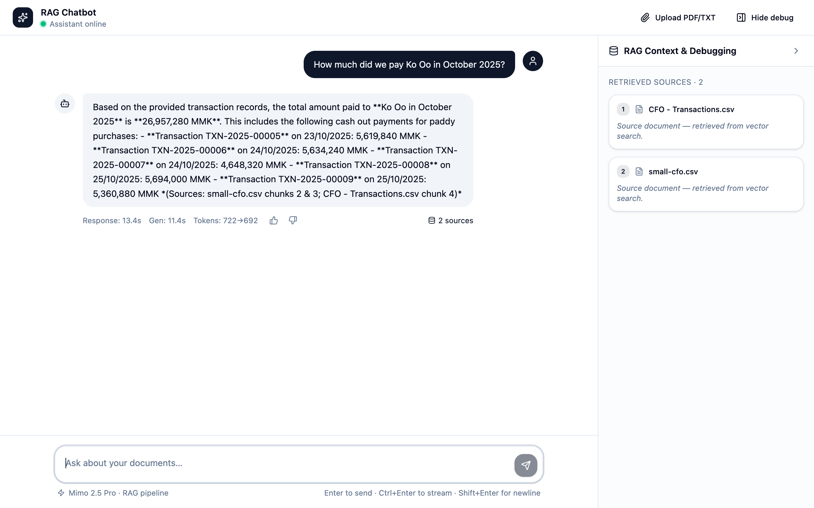
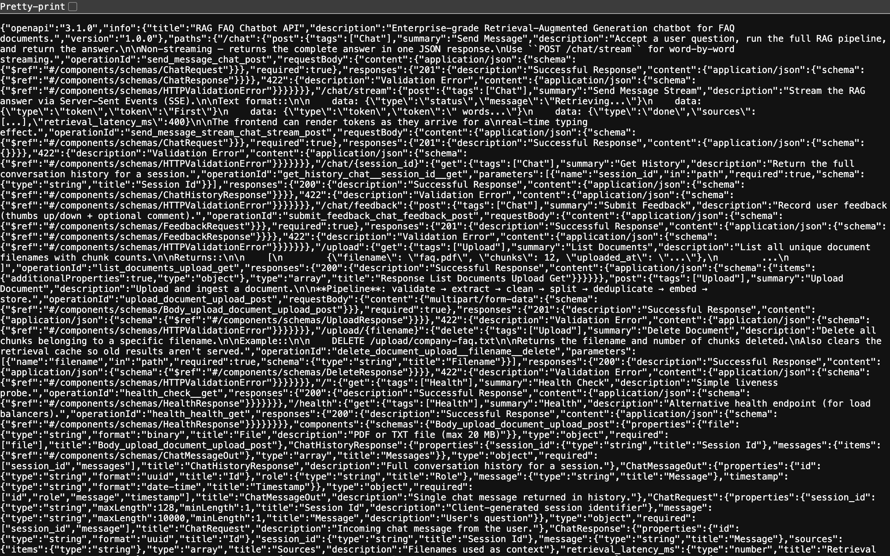

# RAG-based Customer Support Chatbot

A scalable, enterprise-grade Retrieval-Augmented Generation (RAG) chatbot that answers customer queries from internal knowledge bases. Built with **FastAPI**, **Supabase (pgvector)**, **Mimo 2.5 Pro**, and **LangChain** — designed for production workloads with async-first architecture, containerized deployment, and full observability.



> **Live Demo** — [https://rag-chatbot-gamma-flax.vercel.app](https://rag-chatbot-gamma-flax.vercel.app)
>
> **Docker Image** — `docker pull ghcr.io/minntayza/rag-chatbot:latest` *(coming soon)*

---

## Project Overview

This project implements a production-ready support agent that ingests documents (PDF, TXT, CSV), indexes them as vector embeddings in Supabase PostgreSQL with pgvector, and retrieves the most relevant context to generate accurate, grounded answers via the Mimo 2.5 Pro LLM.

**Key design goals:**

- **Accuracy** — Vector similarity search with cosine scoring and fallback thresholds to minimise hallucination
- **Scalability** — Async FastAPI with Redis caching and connection pooling for high concurrency
- **Observability** — Prometheus metrics, Grafana dashboards, and automated RAGAS quality evaluation
- **Security** — Per-IP rate limiting, prompt injection detection, input sanitisation, and Row Level Security on all database tables
- **Production-ready** — Multi-stage Docker builds, CI/CD pipeline, and 99 automated tests

---

## High-Level Architecture

<!-- TODO: Replace with architecture diagram (e.g., draw.io, Excalidraw, or Mermaid) -->

```
┌─────────────┐     ┌──────────────────┐     ┌─────────────────────┐     ┌──────────────┐
│   Client     │────▶│  FastAPI Gateway  │────▶│  RAG Pipeline        │────▶│  Mimo 2.5 Pro │
│  (React UI)  │◀────│  (Rate Limit +    │◀────│  Retrieve + Generate │◀────│  LLM API      │
└─────────────┘     │   Security)       │     └─────────────────────┘     └──────────────┘
                     └────────┬─────────┘              │
                              │                        │
                     ┌────────▼─────────┐     ┌───────▼──────────┐
                     │  Redis Cache      │     │  Supabase +       │
                     │  (Optional)       │     │  pgvector         │
                     └──────────────────┘     └──────────────────┘
```

**Request flow:**

```
User Question → Rate Limit Check → Prompt Injection Detection → Embed Query
    → pgvector Cosine Search → Score Filter (≥0.25) → Top-K Retrieval
    → Context Merge → LLM Generation (Streaming) → Response
```

**Document ingestion pipeline:**

```
Upload → Validate → Extract Text → Clean → Chunk (LangChain) → Deduplicate → Embed → Store in pgvector
```

---

## Tech Stack

| Layer | Technology | Purpose |
|---|---|---|
| **Backend** | FastAPI (Python 3.12) | Async HTTP framework |
| **Vector DB** | Supabase PostgreSQL + pgvector | Document storage and similarity search |
| **Embeddings** | sentence-transformers (`all-MiniLM-L6-v2`) | Local embedding generation (384-dim) |
| **LLM** | Mimo 2.5 Pro (OpenAI-compatible) | Answer generation with streaming |
| **Orchestration** | LangChain | Text splitting and RAG pipeline utilities |
| **Frontend** | React 19 + TanStack Start + shadcn/ui | SSR chat interface |
| **Caching** | Redis + in-memory LRU fallback | Two-tier response caching |
| **Monitoring** | Prometheus + Grafana | Metrics and dashboards |
| **Evaluation** | RAGAS | Automated RAG quality scoring |
| **Container** | Docker + Docker Compose | Multi-stage production builds |
| **CI/CD** | GitHub Actions | Lint → Test → Build pipeline |
| **Testing** | pytest (99 tests) | Unit, integration, and schema tests |

---

## Setup & Installation

### Prerequisites

- Python 3.12+
- Node.js 20+
- Docker & Docker Compose
- A [Supabase](https://supabase.com) project with pgvector enabled

### 1. Clone the repository

```bash
git clone https://github.com/minntayza/rag-chatbot.git
cd rag-chatbot
```

### 2. Configure environment variables

```bash
cd backend
cp .env.example .env
```

Edit `backend/.env` with your credentials:

```env
# ── Supabase ──────────────────────────────────────────────
SUPABASE_URL=https://your-project.supabase.co
SUPABASE_ANON_KEY=your-anon-key
SUPABASE_SERVICE_ROLE_KEY=your-service-role-key

# ── LLM ───────────────────────────────────────────────────
LLM_API_KEY=your-mimo-api-key
LLM_BASE_URL=https://api.mimo.ai/v1
LLM_MODEL=mimo-2.5-pro

# ── Embeddings (local by default — no key required) ───────
EMBEDDING_MODEL=all-MiniLM-L6-v2
EMBEDDING_DIMENSION=384

# ── Redis (optional — falls back to in-memory LRU) ────────
REDIS_URL=redis://localhost:6379/0

# ── App ───────────────────────────────────────────────────
APP_ENV=development
CORS_ORIGINS=["http://localhost:3000","http://localhost:5173"]
```

### 3. Set up the database

Run the migration SQL in your Supabase SQL Editor to create tables, indexes, RLS policies, and the `match_documents()` pgvector search function:

```bash
cat backend/supabase_migration.sql
```

### 4. Install dependencies

**Backend:**

```bash
cd backend
python3 -m venv venv
source venv/bin/activate
pip install -r requirements.txt
```

**Frontend:**

```bash
npm install
```

---

## How to Run

### Local Development

Run backend and frontend in separate terminals:

```bash
# Terminal 1 — Backend
cd backend
source venv/bin/activate
uvicorn main:app --reload --port 8000

# Terminal 2 — Frontend
npm run dev
```

Open **http://localhost:5173** (or the port Vite assigns).

### Docker (Production)

```bash
# Build and start API + Redis
docker compose up -d

# With monitoring stack (Prometheus + Grafana)
docker compose --profile monitoring up -d

# View logs
docker compose logs -f api
```

| Service | URL |
|---|---|
| API | http://localhost:8000 |
| Prometheus | http://localhost:9090 |
| Grafana | http://localhost:3001 (admin/admin) |

### Running Tests

```bash
cd backend
pytest -v --tb=short                          # All 99 tests
pytest tests/unit/ -v --tb=short              # Unit tests only
pytest tests/integration/ -v --tb=short       # Integration tests (requires Supabase secrets)
```

---

## API Endpoints

| Method | Endpoint | Description |
|---|---|---|
| `POST` | `/upload` | Upload PDF, TXT, or CSV document |
| `GET` | `/upload` | List all uploaded documents |
| `DELETE` | `/upload/{filename}` | Delete a document and its chunks |
| `POST` | `/chat` | Send a question (non-streaming) |
| `POST` | `/chat/stream` | Send a question (SSE streaming) |
| `GET` | `/chat/{session_id}` | Retrieve conversation history |
| `POST` | `/chat/feedback` | Submit thumbs up/down feedback |
| `GET` | `/health` | Deep readiness probe (DB + cache + LLM) |
| `GET` | `/metrics` | Prometheus metrics endpoint |



---

## Monitoring & Observability

### Prometheus Metrics

20+ metrics exposed at `/metrics`:

- **HTTP** — Request counts, latencies, in-flight requests
- **RAG** — Retrieval duration, generation duration, query counts
- **Tokens** — Input/output token usage per request
- **Cache** — Hit/miss ratios across LRU and Redis tiers
- **RAGAS** — Faithfulness, answer relevancy, context recall, context precision

### RAGAS Quality Evaluation

Automated quality scoring on a configurable sample of queries (default: 10%):

| Metric | Description | Target |
|---|---|---|
| Faithfulness | Answer grounded in retrieved context | ≥ 0.7 |
| Answer Relevancy | Answer matches question intent | ≥ 0.6 |
| Context Recall | Relevant chunks retrieved | ≥ 0.5 |
| Context Precision | Retrieved chunks are relevant | ≥ 0.5 |

---

## Future Roadmap

- [ ] **RAGAS CI Integration** — Gate deployments on quality score thresholds
- [ ] **Model versioning** — Track embedding model versions and re-index on upgrades
- [ ] **A/B testing framework** — Compare LLM prompts and retrieval strategies
- [ ] **Multi-tenant support** — Isolated knowledge bases per organisation
- [ ] **Hybrid search** — Combine pgvector semantic search with full-text search (tsvector)
- [ ] **Feedback loop** — Fine-tune retrieval ranking from user feedback signals
- [ ] **LangSmith integration** — Distributed tracing for RAG pipeline debugging
- [ ] **Kubernetes deployment** — Helm charts for production orchestration

---

## License

This project is licensed under the MIT License — see the [LICENSE](LICENSE) file for details.
